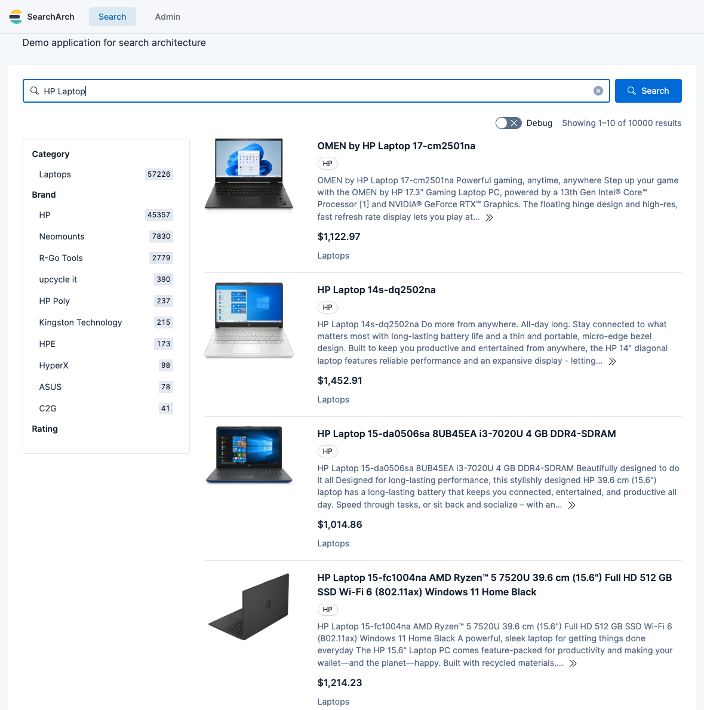

# Icecat Product Data Harvester

A robust Python toolset to harvest, parse, and organize product data from the [Open Icecat](https://icecat.biz) XML interface.

This project is designed as an **ETL (Extract, Transform, Load) pipeline**:
1.  **Extract:** Downloads raw XML files for specific categories from the Icecat repository.
2.  **Transform:** Parses local XML files into clean, flat NDJSON files ready for search engines.

More context and rationale: [From messy product feeds to demo-ready e-commerce data](https://alexmarquardt.com/elastic/ecommerce-demo-data/)

## Features

* Downloads and parsing are distinct steps. You can modify your JSON schema and re-parse millions of products without re-downloading them.
* The downloader checks the file index and skips files you already have.
* Built as a proper Python package (`src-layout`) for better manageability.
* Uses uv for environment management and tqdm for progress tracking.

## Project Structure

```text
icecat-harvester/
├── data/                  # All data lives here (ignored by git)
│   ├── xml_source/        # Raw XML files (The "Truth")
│   └── products/          # Processed NDJSON files (The "Output")
│   └── sample-data/       # TRACKED: Versioned samples
├── src/
│   └── icecat_harvester/  # Python Package
│       ├── download_xml.py
│       ├── xml_to_json.py
│       └── ...
├── pyproject.toml         # Dependencies
├── targets.txt            # List of categories to download
└── .env                   # Credentials
```

## Prerequisites

* **Icecat Account:** You need a free [Open Icecat](https://icecat.biz/en/menu/register/user) account.
* **uv:** This project uses [uv](https://github.com/astral-sh/uv) for fast Python management.
    * *Mac/Linux:* `curl -LsSf https://astral.sh/uv/install.sh | sh`
    * *Windows:* `powershell -c "irm https://astral.sh/uv/install.ps1 | iex"`

## Installation

1.  **Clone the repository:**
    ```bash
    git clone [https://github.com/alexander-marquardt/icecat-harvester.git](https://github.com/alexander-marquardt/icecat-harvester.git)
    cd icecat-harvester
    ```

2.  **Sync Dependencies:**
    This creates the virtual environment and installs all required libraries (requests, tqdm, etc.).
    ```bash
    uv sync
    ```

3.  **Configure Credentials:**
    Create a `.env` file in the root directory:
    ```bash
    cp .env.example .env
    ```
    Add your Icecat username and password inside `.env`.

## Usage

All commands are run using `uv run -m` to execute the modules within the package context.

### 1. Configure Targets
Edit the `targets.txt` file in the root directory. Add the categories you want to harvest, one per line:
```text
Laptops
Smartphones
Washing Machines
```

### 2. Update Category Map
Download the latest mapping of Category IDs to Names. This ensures the downloader can find the categories you listed in `targets.txt`.
```bash
uv run -m icecat_harvester.get_category_names
```

### 3. Download Data (Extract)
This script downloads the **Raw XML** files into `data/xml_source/`.
* It checks the Icecat index.
* It skips files you already have.
* It organizes files into folders by category.

```bash
uv run -m icecat_harvester.download_xml
```

### 4. Process Data (Transform)

This script reads your local XML files and converts them into clean **NDJSON** (Newline Delimited JSON) files. Use the `--output-subdir` flag to organize your output.

#### 4a. Processing the Full Dataset

This command processes all downloaded XML files and saves the output to a specified subdirectory within `data/products/`.

```bash
uv run -m icecat_harvester.xml_to_json --output-subdir "full_dataset_v1"
```

If you do not specify an `--output-subdir`, a new directory named with the current timestamp (e.g., `20260113-153000`) will be created automatically to prevent accidental data loss.

Because download and parsing are separate, you can adjust the output schema and re-run `xml_to_json` without re-downloading the XML.

#### 4b. Seeding Sample Data (Standalone Mode)

Use this command to generate a small, representative dataset (e.g., 10 products per category) into data/sample-data/. This folder is tracked by Git and allows others to see the schema without downloading the full dataset.

```bash
uv run -m icecat_harvester.xml_to_json --generate-sample-data 10
```
Note: This will clear the sample-data folder and recreate it with fresh samples.

#### 4c. Reproducibility & Seeds
The harvester shuffles files to ensure a diverse sample. By default, it uses seed 42. This means that two people running the same command on the same XML source will get the exact same row ordering.

To generate a different (but still stable) variation, use a different seed:

```bash
uv run -m icecat_harvester.xml_to_json --generate-sample-data 10 --seed 123
```

### 5. Check Statistics (Optional)
See how many products exist in the index for your categories versus how many you have downloaded.
```bash
uv run -m icecat_harvester.stats
```

### 6. Combine JSON Files (Optional)

The `xml_to_json` script creates a directory for each category, containing multiple batch files. This is efficient for processing, but some downstream tools may expect a single NDJSON file per category.

This script combines the batch files into a single file for each category.

**Example:** Take the output from the `full_dataset_v1` run and combine the files:
```bash
uv run -m icecat_harvester.combine_json "full_dataset_v1"
```

This will create a new directory, `data/products_combined/`, containing the combined files (e.g., `Laptops.ndjson`, `Smartphones.ndjson`). You can change the output directory with the `--output-dir` flag.

## Output Format

The xml_to_json script produces NDJSON (Newline Delimited JSON) files. Each line is one JSON object representing a single product.


### Schema Overview

| Field | Type | Description |
| :--- | :--- | :--- |
| `id` | string | Unique Icecat product identifier. |
| `title` | string | Full product name and marketing title. |
| `brand` | string | Manufacturer name (e.g., Lenovo, HP). |
| `description` | string | Cleaned text description (HTML tags removed). |
| `price` | float | Estimated/Heuristic price in USD. |
| `image_url` | string | Primary high-resolution product image URL. |
| `categories` | list | List of category names assigned to the product. |
| `attrs` | object | **Flattened Dictionary** of technical specifications. |
| `attr_keys` | list | List of all keys available in `attrs` (used for search facets). |

### Example Record

```json
{
  "id": "91778569",
  "title": "Lenovo Legion 5 15ARH05H AMD Ryzen™ 7 4800H Laptop...",
  "brand": "Lenovo",
  "description": "Minimal meets mighty... Thermally tuned via Legion Coldfront 2.0.",
  "price": 865.33,
  "currency": "USD",
  "image_url": "https://images.icecat.biz/img/gallery_mediums/79117985_5269963235.jpg",
  "categories": ["Laptops"],
  "attrs": {
    "Processor family": "AMD Ryzen™ 7",
    "Internal memory": "16 GB",
    "Weight": "2.46 kg"
  },
  "attr_keys": ["Processor family", "Internal memory", "Weight"]
}
```

## A small sample of cleaned NDJSON files

You can look into `data/sample-data` to see a few JSON product documents that were generated by the scripts in this repository

## Example search application built with the cleaned data


## License

* **Code:** [MIT License](LICENSE)
* **Data:** The product data downloaded by these scripts is subject to the [Open Icecat content license / terms](https://icecat.biz/en/menu/support/terms-conditions).

> **Disclaimer:** This tool is not affiliated with Icecat NV. Users are responsible for ensuring their use of the data complies with Icecat's terms.